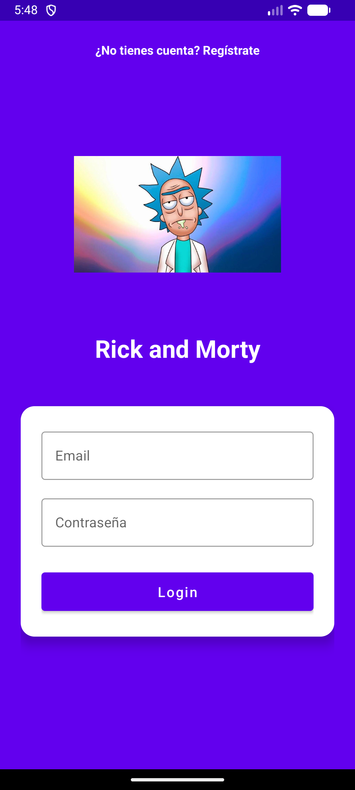
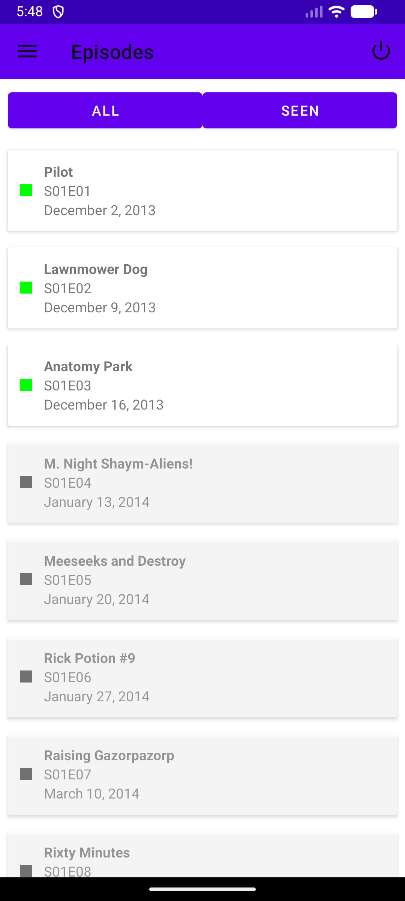
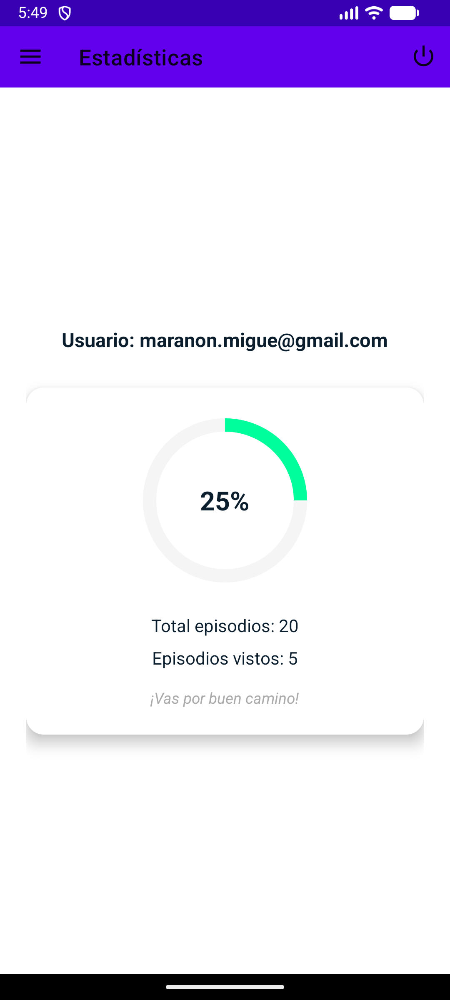
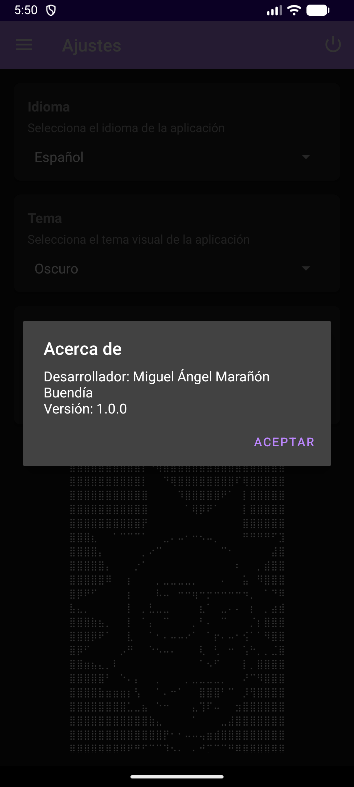

# 🎬 Seguimiento de Series - Rick y Morty (TAREA 3 - PMDM - 2025/2026)
 
## Introducción
Aplicación Android diseñada para ayudar a los usuarios a gestionar y llevar un registro de las series de Rick y Morty  que ven. Su propósito principal es ofrecer una experiencia intuitiva para marcar episodios vistos y obtener estadísticas de visualización.

## Características principales

### 🔐 Autenticación
- Registro e inicio de sesión con email/contraseña mediante Firebase Authentication.
- Sesión persistente (el usuario permanece logueado al cerrar la app).

### 📺 Gestión de series
- Búsqueda de series a través cargadas desde API. 
- Agregar capítulos a "LISTA DE VISTOS" 

### ✅ Marcado de episodios
- Marcar/desmarcar episodios individuales como vistos.
- Sincronización instantánea con Firestore.

### 🔍 Filtros y organización
- Búsqueda en tiempo real dentro de "Mi lista".

### 📊 Estadísticas
- Progreso general: porcentaje de episodios vistos.
- Número de capitulos vistos sobre el total.
- Mensajes de estímulo según el porcentaje de capítulos vistos.

### ⚙️ Ajustes personalizables
- Tema claro/oscuro/configuración automática.
- Idioma (español/inglés).

### 🔄 Sincronización en la nube
- Los datos del usuario se guardan en Firestore.
- Acceso desde múltiples dispositivos con la misma cuenta.
- Sincronización automática cuando se recupera conexión.

## Tecnologías utilizadas

### 📱 UI/UX
- **RecyclerView** con múltiples ViewTypes
- **ViewBinding** para referencias seguras a vistas
- **Navigation Component** para gestión de fragmentos

### 🔥 Backend y servicios
- **Firebase Authentication** (login/registro)
- **Cloud Firestore** (base de datos NoSQL en tiempo real)
- **Retrofit 2 + Gson** para consumo de API REST
- **R&M API** como fuente de datos de series - https://rickandmortyapi.com/api/

### 💾 Almacenamiento local
- **SharedPreferences** para ajustes de usuario
- **Room Database** (opcional, para caché offline)
- **Glide** para carga eficiente de imágenes

## Capturas de pantalla

## Instrucciones de uso

### 1. Clonar el repositorio

git https://github.com/MaMbDev/RickAndMortyTarea3.git

## CONCLUSIONES

Apredizaje:

 - Integración servicio Firebase en la app.
 - Manejo de esttados en RecyclerView.
 - Integración de ViewModel y LiveData para un UI reactva.

Dificultades superadas:

 - Sincronización offline/online con Firestore y caché local.
 - Gestión de la autenticación.
 - Mantener la consistencia de datos entre SharedPreferences y Firestore.

